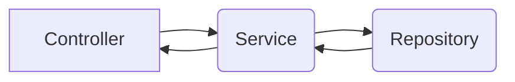

# Bem-vindo ao Projeto Cliente-API

Este projeto é uma API criada para a manipulação de clientes.
Nele teremos as seguintes funções:

- Incluir novo cliente.
- Atualizar cliente.
- Remover cliente por ID.
- Lista cliente por ID.
- Lista todos os clientes.

## Tecnologias
O projeto foi inteiramente desenvolvido na linguagem de programação Java, porém para obter a melhor desempenho,
utilizamos alguns frameworks e bibliotecas, são elas:

- Spring-Boot
- Spring-Cloud
- Spring Devtools
- Spring Validation
- SpringDoc OpenAPI (Swagger)
- H2 Database
- Lombok

## Documentação

Este projeto foi documentado através do Swagger, para acessar a documentação deve inicializar o projeto e logo
em seguida acessar o link.

- http://localhost:8080/swagger-ui.html

## Arquitetura 

Nesse projeto seguimos a seguinte arquitetura:

## Autor

- Diogo Lacerda 

## Licença

MIT
Software Livre, É isto!